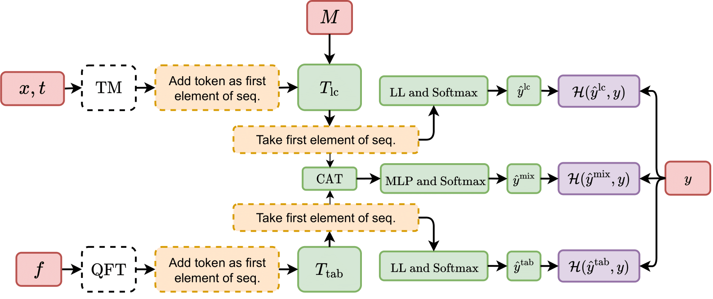

# ATAT

ATAT: Astronomical Transformer for time series And Tabular data consists of two Transformer models that encode light curves and features using novel time modulation and quantile feature tokenizer mechanisms, respectively.



## Main code scripts

```
📦ATAT
 ┣ 📜 get_important_files.sh: obtains the K-Folds, features (feat) and trained models used in the paper.

# Data
 ┣ 📜 get_data.py: main file to download, process and generate the dataset.
 ┣ 📂 src
 ┃ ┣ 📂 data 
 ┃ ┃ ┣ 📜 get_fits_elasticc_data.py: extracts the data from the .FITS and leaves it in .pkl files per class.
 ┃ ┃ ┣ 📜 get_lc_md.py: normalizes the times, generates the mask of the observations by filter and concatenates the metadata.
 ┃ ┃ ┣ 📜 get_partitions.py: generates the split into training, validation and test data considering the taxonomy used in the paper.
 ┃ ┗ ┗ 📜 get_qt_feat_and_h5_file.py: trains the Quantiles Feature Tokenizer (QFT), by folds and on different days, on the metadata and calculated features. This also generates the final data set in .h5 format.
 
# Training
 ┣ 📜 train.py: main file to run the experiments.
 ┣ 📜 parser_1.py: contains all available hyperparameters. Some of these will be assigned by JSON dictionaries.
 ┣ 📜 main_model.py: base model used to generate the dataloader and perform the training and validation loops.
 ┣ 📜 datasets.py: contains the dataloader and dictionaries with dataset information.
 ┣ 📂 layers
 ┃ ┣ 📜 encoder_ellastic.py: encoder that generates the main architecture of the transformers.
 ┃ ┣ 📜 mha.py: multihead attention class.
 ┃ ┗ 📜 time_modulator.py: time modulator/positional encoding class that generate the input representation for the attention layers.
 ┣ 📂 scripts: contains dictionaries with hyperparameters that depend on the training to be used.
 ┃ ┣ 📂 searching_e
 ┃ ┃ ┗ 📜 spec.json: JSON that contains the hyperparameters necessary to run the selected experiment from the searching folder.
 ┃ ┣ 📂 searching
 ┃ ┃ ┣ 📜 lc.json: JSON containing the light curve-only experiments.
 ┃ ┃ ┣ 📜 tab.json: JSON containing the tabular data-only experiments.
 ┃ ┃ ┣ 📜 lc_tab.json: JSON containing the experiments using light curves and tabular data.
 ┃ ┃ ┗ 📜 ablation.json: JSON containing the ablation study experiments.
 ┃ ┗ 📂 general
 ┃ ┗ ┗ 📜 ELASTICC.json: JSON that contains general hyperparameters of the architecture.

# Metrics and visualization
 ┣ 📜 get_metrics.py: obtains the total predictions and on different days of the trained models to obtain the metrics.
 ┃ 📂 notebooks
 ┃ ┃ ┣ 📜 plot_metrics_times.ipynb: plots performance at different times of the light curve.
 ┃ ┃ ┣ 📜 classification_metrics.ipynb: generates a classification report.
 ┗ ┗ ┗ 📜 confusion_matrices.ipynb: plots confusion matrices.
 ```

The steps to run ATAT are the following:

## Create enviroment

Firstly, you should create the enviroment:

- conda create -n ATAT pytorch==1.11.0 torchvision==0.12.0 torchaudio==0.11.0 cudatoolkit=11.3 -c pytorch
- conda activate ATAT
- pip install "ray[tune]==1.13" torchmetrics==0.9 wget==3.2 astropy==5.3.4 pyarrow==14.0.1 fastparquet==2023.10.1 pandas==1.5.3 matplotlib==3.8.2 scikit-learn==1.3.2 h5py==3.10.0 seaborn==0.13.0 param==2.0.1 umap-learn==0.5.5 filelock==3.13.1 tabulate==0.9.0 panel==1.3.1 holoviews==1.18.1 pytorch-lightning==1.6 gdown==5.2.0

## Important files

You must use the following link to download the same K-Folds used in the paper:

```
bash get_important_files.sh data_partition_paper
```

The calculated features used in the paper can be obtained from the following link ( if you do not download these files you will not be able to run the experiments with features (feat), that is, you will only be able to use the light curves (lc) and the metadata (header) ):

```
bash get_important_files.sh dynamic_features
```

(optional) You can obtain the models used in the paper and the metrics using the following link:

```
bash get_important_files.sh results_paper
bash get_important_files.sh results_rf_paper
```

If you have problems downloading, you can get the files from here:

https://drive.google.com/drive/folders/1uVOSJ1WMJH3o-5Czqx0WBcdmtf548GQ1?usp=sharing

These files should be unzipped in the same project folder.

## Get data

First you should download the data from `https://portal.nersc.gov/cfs/lsst/DESC_TD_PUBLIC/ELASTICC_TRAINING_SAMPLES/FULL_ELASTICC_TRAIN.tar` and place it inside the project in a folder named `data_original_fits`.

After that, you should process the data. It can be done running

```
python get_data.py
```

This script is set to process with the same partitions used in the paper. The final dataset and the trained QFT will be in the file called `final_dataset`.

## Training

To run ATAT you can execute the following commands depending on what you want to train (take all available GPUs). This will generate a file called `results`:

```
# Run the training with only light curves
python train.py --general ELASTICC --general_e train --searching lc --searching_e spec --selec_col 10 14 18 22 --name_exp lc

# Run the training with only tabular information
python train.py --general ELASTICC --general_e train --searching tab --searching_e spec --selec_col 10 14 18 22 --name_exp tab

# Run the training with light curves and tabular information together
python train.py --general ELASTICC --general_e train --searching lc_tab --searching_e spec --selec_col 10 14 18 22 --name_exp lc_tab

# Run the ablation study
python train.py --general ELASTICC --general_e train --searching ablation --searching_e spec --selec_col 10 14 18 22 --name_exp ablation
```

You can also define the gpu used by putting CUDA_VISIBLE_DEVICES=gpu before the command line. For example: 

```
CUDA_VISIBLE_DEVICES=0 python train.py ...
```

## Evaluating performance

When you have the models trained you can obtain the predictions and evaluate the performance in 1, 2, 4, 8, 16, 32, 64, 128, 256, 512, 1024 and 2048 days using

```
python get_metrics.py
```

This generates a file called `predictions_times.pt` within the files of each trained model. To get the results, you can use the [notebooks/plot_metrics_times.ipynb](notebooks/plot_metrics_times.ipynb), [notebooks/classification_metrics.ipynb](notebooks/classification_metrics.ipynb), and [notebooks/confusion_matrices.ipynb](notebooks/confusion_matrices.ipynb) notebooks which plots the evaluated F1 score metric over time, reports the metrics, and show the confusion matrices, respectively.

